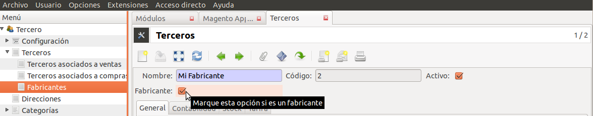

=======================
Fabricante del producto
=======================

Este módulo:

* Añade información del fabricante al producto en la pestaña **Fabricante**:
  fabricante (empresa), nombre del fabricante y código del fabricante.
* En las empresas puede marcar que empresas son fabricantes. Dispone de un
  nuevo menú para filtrar todas las empresas que son fabricantes.
* En pedidos de venta, pedidos de compra y albaranes dispone del campo
  *Fabricante* en las lineas como título informativo del producto.

Módulos que dependen
====================

Instalados
----------

.. toctree::
   :maxdepth: 1

   /purchase/index
   /product/index
   /sale/index
   /stock/index

Dependencias
------------

* Compras_
* Producto_
* Stock_
* Ventas_

.. _Compras: ../purchase/index.html
.. _Producto: ../product/index.html
.. _Stock: ../sale/index.html
.. _Ventas: ../stock/index.html
